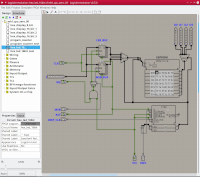
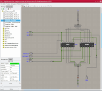

---

Branch [master](https://github.com/logisim-evolution/logisim-evolution/tree/master): 

Branch [develop](https://github.com/logisim-evolution/logisim-evolution/tree/develop): 

---

# Logisim-evolution #

* **Table of contents**
  * [Features](#features)
  * [Requirements](#requirements)
  * **[Downloads](#download)**
    * [Nightly builds (unstable)](#nightly-builds)
  * [Pictures of Logisim-evolution](docs/pics.md)
  * [More Information](docs/docs.md)
  * [Bug reports & feature requests](https://github.com/logisim-evolution/logisim-evolution/issues)
  * [For developers](docs/developers.md)
  * [How to contribute](docs/developers.md#how-to-contribute)
  * [Credits](docs/credits.md)

---

## Features ##

`Logisim-evolution` is educational software for designing and simulating digital logic circuits.
`Logisim-evolution` is [free](#license), [open-source](https://github.com/logisim-evolution), and [cross-platform](#requirements).

Project highlights:

* easy to use circuit designer,
* logic circuit simulations,
* chronogram (to see the evolution of signals in your circuit),
* electronic board integration (schematics can be simulated on real hardware),
* VHDL components (components behavior can be specified in VHDL!),
* TCL/TK console (interfaces between the circuit and the user),
* huge library of components (LEDs, TTLs, switches, SoCs),
* supports [multiple languages](docs/docs.md#translations),
* and more!

---

## Requirements ##

`Logisim-evolution` is a Java application; therefore, it can run on any operating system supporting the Java runtime enviroment.
It requires [Java 16 (or newer)](https://www.oracle.com/java/technologies/javase-downloads.html).

---

## Download ###

`Logisim-evolution` is available for
[download in compiled form](https://github.com/logisim-evolution/logisim-evolution/releases)
with ready to use installable packages for Windows, macOS, and Linux
or in [source code form](https://github.com/logisim-evolution), which you can [build yourself](docs/developers.md).

The following [platform specific packages](https://github.com/logisim-evolution/logisim-evolution/releases)
include the Java runtime and do not require it to be installed separately:

* `logisim-evolution_<version>-1_amd64.deb`: Debian package (also suitable for Ubuntu and derivatives),
* `logisim-evolution-<version>-1.x86_64.rpm`: Package for Fedora/Redhat/CentOS/SuSE Linux distributions,
* `logisim-evolution-<version>.msi`: Installer package for Microsoft Windows,
* `logisim-evolution-<version>.dmg`: macOS package. Note that `Logisim-evolution` may also be installed
  using [MacPorts](https://www.macports.org/) (by typing `sudo port install logisim-evolution`)
  or via [Homebrew](https://brew.sh/) (by typing `brew install --cask logisim-evolution`).

The Java JAR [`logisim-evolution-<version>-all.jar`](https://github.com/logisim-evolution/logisim-evolution/releases)
is also available and can be run on any system with a supported Java runtime installed.

**Note for macOS users**:
The Logisim-evolution.app is not signed with an Apple approved certificate.

When launching the application for the first time, you will have to start it via the "Open" entry in the
application icon's context menu in the macOS Finder. This is either done by clicking the application
icon with the right mouse button or holding down <kbd>CTRL</kbd> while clicking the icon with the
left mouse button. This will open a panel asking you to verify that you wish to launch the application.
On more recent versions of macOS, the panel will only give you a choice of moving the app to the trash or Cancel.
On those systems, click Cancel, open `System Preferences`, and select `Security & Privacy`.
There you may need to click the lock to make changes and authenticate with an administrative acccount.
It should show an option to open the app.
See [Safely open apps on your Mac](https://support.apple.com/en-us/HT202491) for more information.

Depending on your security settings, you may also get a panel asking if you wish to allow it to accept
network connections. You can click "Deny" as we do not need network access currently nor we do request any.

### Nightly builds ###

We also offer builds based on the current state of the
[develop](https://github.com/logisim-evolution/logisim-evolution/tree/develop) branch.
If the develop branch has been changed,
a new `Nightly build` is created at midnight [UTC](https://en.wikipedia.org/wiki/Coordinated_Universal_Time).

Note that these builds may be unstable since the develop branch is a work in progress.

To get nightly downloads, please
[click here](https://github.com/logisim-evolution/logisim-evolution/actions/workflows/nightly.yml)
and browse to the last successful run of `Nightly build`, which should be on top. Note that due to Github internals,
all files are provided as ZIP archives. You must unzip the downloaded file to get the package for installation.

Please share your experience in [Discussions](https://github.com/logisim-evolution/logisim-evolution/discussions)
or [open a ticket](https://github.com/logisim-evolution/logisim-evolution/issues)
if you found a bug or have suggestions for improvement.

---

## License ##

* `Logisim-evolution` is copyrighted ©2001-2021 by Logisim-evolution [developers](docs/credits.md).
* This is free software licensed under [GNU General Public License v3](https://www.gnu.org/licenses/gpl-3.0.en.html).
