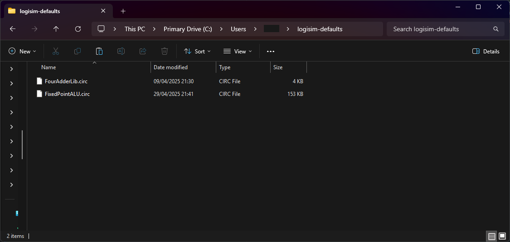

# Automatically Importing Logisim Libraries

Logisim Evolution supports loading custom libraries at startup, contained in Logisim `.circ` files.
To do this, create a directory in your **home directory** named `logisim-defaults` and insert any Logisim libraries you
would like to load every time Logsim Evolution starts. **Every circuit must have a unique name, and must not be called
"main"**. This is to avoid conflicts caused by loading libraries with the same name.

