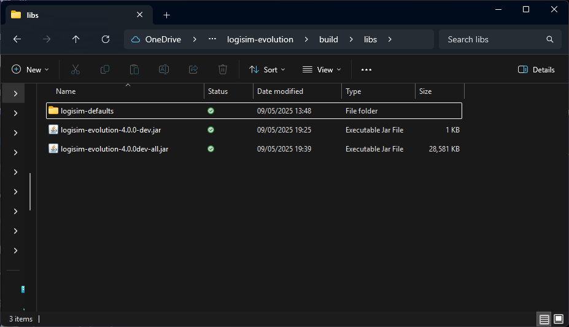
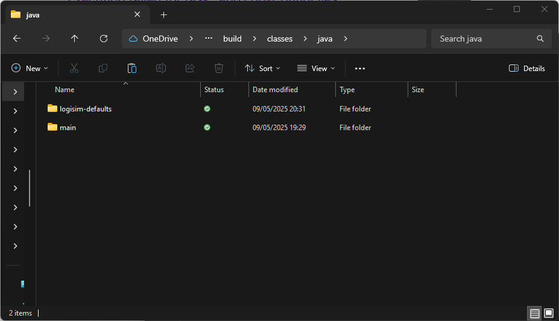
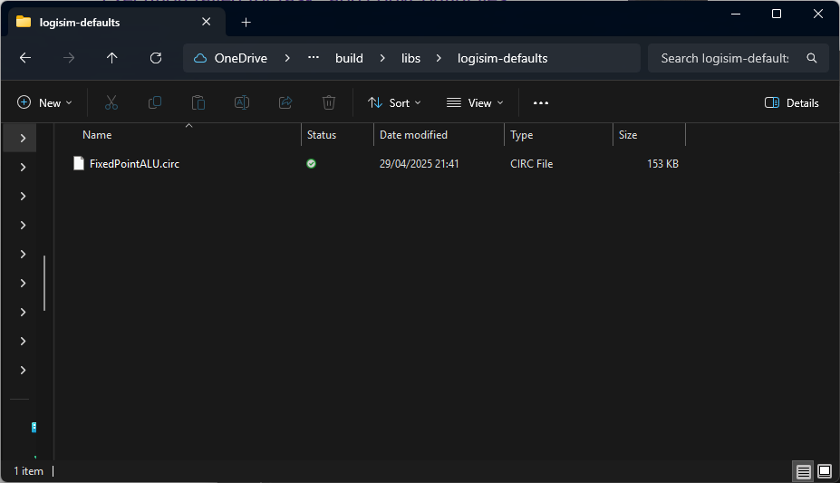

# Automatically Importing Logisim Libraries

Logisim Evolution supports loading custom libraries at startup, contained in Logisim `.circ` files.

To do this, create a directory named `logisim-defaults` in either:

- The same directory as the `.jar` file which is executing Logisim. When using a packaged installer,
  this is inside an `app` subdirectory of the installation folder. For example:
  - Windows: `C:\Program Files\logisim-evolution\app`
  - Linux: `/opt/logisim-evolution/lib/app`
  - macOS: inside the `.app` bundle at `logisim-evolution.app/Contents/app`

  
- Inside `build/classes/java/main/`, if running from Gradle. 

Inside the `logisim-defaults`folder should be any `.circ` files which you would like to load automatically at startup.
**Every circuit must have a unique name, and must not be called
"main"**. This is to avoid conflicts caused by loading libraries with the same name.

Please note that any files added using the `logisim-defaults` folder are third-party,
and therefore will need referencing for any projects you use them in.

As of present, libraries are only automatically imported on *startup*. By creating a new file through the user interface,
only built-in libraries will be imported.
