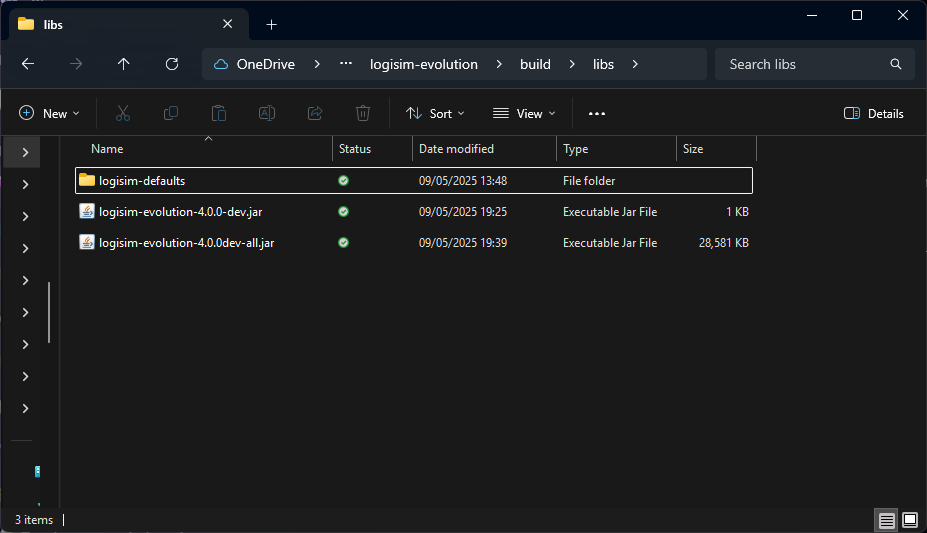
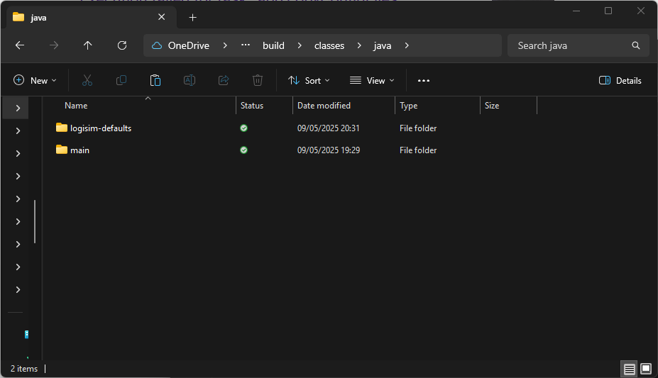
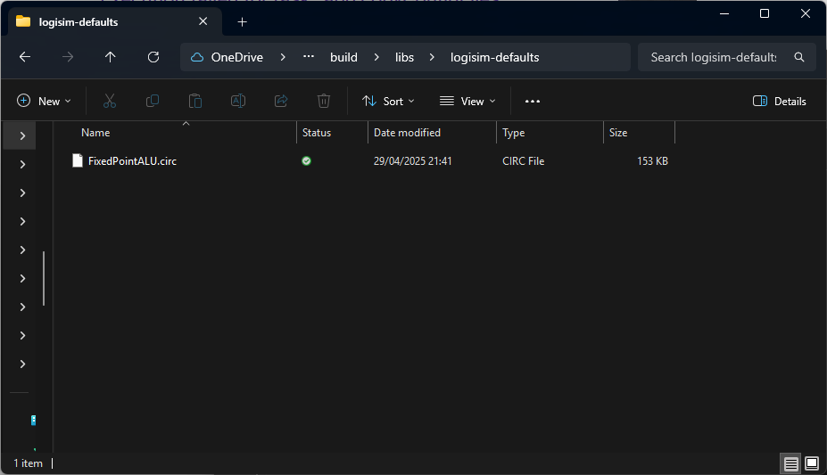

# Automatically Importing Logisim Libraries

Logisim Evolution supports loading custom libraries at startup, contained in Logisim `.circ` files.

To do this, create a directory named `logisim-defaults` in the program directory used to start Logisim Evolution:

- For an installed application, this is the application directory. On a default Windows install, that may be
  `C:\Program Files\logisim-evolution\app\logisim-defaults`.
- For a standalone `.jar`, place `logisim-defaults` in the same directory as the `.jar` file that starts Logisim Evolution.
  
- For a Gradle run, place `logisim-defaults` inside `/build/classes/java/`.
  

Inside the `logisim-defaults` folder should be any `.circ` files which you would like to load automatically at startup.
**Every circuit must have a unique name, and must not be called
"main"**. This is to avoid conflicts caused by loading libraries with the same name.



Please note that any files added using the `logisim-defaults` folder are third-party,
and therefore will need referencing for any projects you use them in.

As of present, libraries are only automatically imported on *startup*. By creating a new file through the user interface,
only built-in libraries will be imported.

## Loading a single library via the command line

If you only need to load one or two libraries — for example while developing a `.jar` library and
wanting to quickly test it without copying it into `logisim-defaults` — pass it directly with
`--load-library`:

```sh
logisim-evolution --load-library path/to/my-lib.circ --load-library path/to/my-lib.jar
```

The option can be repeated to load several libraries, and accepts both `.circ` files and `.jar`
files. For a `.jar` file, its manifest must declare a `Library-Class` attribute pointing at the
library's entry class, the same way a JAR loaded through *Project → Load Library → Load JAR
Library…* does.
