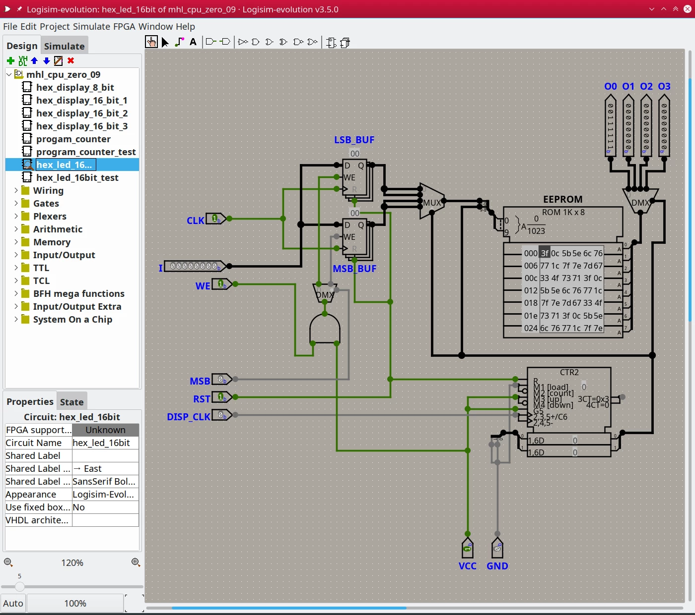
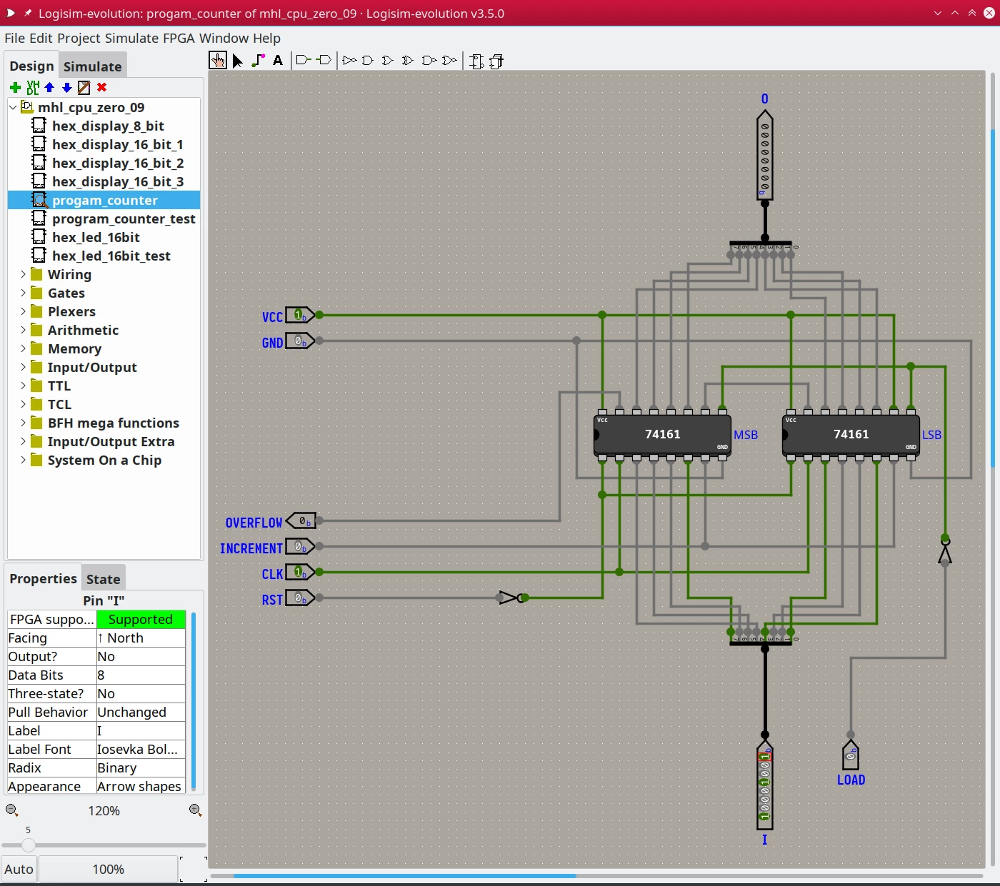

---

# Additional information #

* [« Go back](../README.md)
* **Screenshots**
  * [KDE](#kubuntu)

## Project history ##

Images demonstrating Logisim-evolution in action, running on various platforms.
(pictures are 1400x1200, WebP format):

## Kubuntu ##

